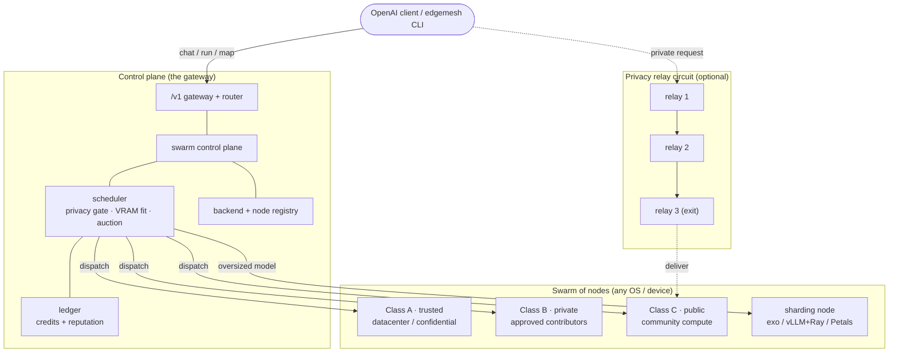

# edgemesh

**One model catalog and one `/v1` endpoint across every inference backend you run —
then a decentralized compute *swarm* on top: schedule, execute, stream, shard, and
privately relay AI work across any number of devices, on any OS.**

[](.github/workflows/ci.yml)


edgemesh starts where most local-AI setups get stuck: you have models running in
more than one place — the Cognis fleet, Ollama, llama.cpp, vLLM, a hosted API, a
friend's GPU box — and nothing unifies them. edgemesh **discovers** them, presents
**one OpenAI-compatible gateway**, and then lets you grow that into a **swarm**: a
trust-tiered, scheduled, credit-metered, optionally onion-routed compute network.

The **core is pure standard library** (runs anywhere Python 3.10+ runs). Two
features are opt-in extras: mutual TLS (system `openssl` for dev certs) and the
privacy relay (`pip install edgemesh[relay]` for real layered encryption).

---

## System architecture



## Install

```bash
# Linux / macOS
./install.sh
# Windows (PowerShell)
./install.ps1
# from pip (core)            … add the relay extra for onion routing
pip install "git+https://github.com/cognis-digital/edgemesh.git"
pip install "edgemesh[relay] @ git+https://github.com/cognis-digital/edgemesh.git"
```

## Two ways to drive it

```bash
edgemesh setup     # guided first-run wizard (detects hardware, finds backends)
edgemesh menu      # numbered interactive control surface
```

## Connect backends & fit models to hardware

```bash
edgemesh discover --save        # probe localhost (Cognis fleet, Ollama, llama.cpp, …)
edgemesh fleet --save           # one-shot: register the Cognis fleet
edgemesh add my-vllm http://10.0.0.5:8000 --save
edgemesh models                 # unified catalog: model -> which backends serve it
edgemesh hardware               # CPU/RAM/GPU/VRAM + the model-fit budget
edgemesh catalog                # curated models that FIT this machine (largest first)
edgemesh catalog --no-uncensored      # toggle censored vs uncensored model selection
edgemesh pull qwen2.5-7b        # download via ollama / huggingface-cli
```

Run the gateway and talk to the whole mesh through one endpoint:

```bash
edgemesh serve --port 8780
curl http://127.0.0.1:8780/v1/chat/completions -H 'Content-Type: application/json' \
  -d '{"model":"coding","messages":[{"role":"user","content":"hi"}],"stream":true}'
```

Routing: the first backend that lists the model wins; force one with
`backend::model` (e.g. `"uncensored-fleet::uncensored"`). `"stream": true` is relayed
through verbatim as Server-Sent Events.

---

## The swarm: decentralized compute

Turn many devices into one orchestrated network. One node is the **coordinator**
(`edgemesh serve`); every other device **joins** with a trust class.

```bash
edgemesh serve                                 # coordinator = gateway + control plane
edgemesh node http://<coord-ip>:8780 --class C # a device joins, advertises its backend
edgemesh swarm                                 # nodes + ledger
edgemesh run "summarize this" --model llama3.1-8b   # scheduled → executed → settled
```

### Request lifecycle

```mermaid
sequenceDiagram
    participant U as Consumer
    participant G as Gateway / control plane
    participant S as Scheduler
    participant N as Node (backend)
    participant L as Ledger
    U->>G: POST /swarm/run {model, messages, data_class}
    G->>S: rank eligible nodes (privacy gate → VRAM fit → reputation/price)
    S-->>G: best-first candidate list
    loop failover
        G->>N: forward OpenAI request (or open SSE stream)
        alt node errors
            N--xG: failure
            G->>L: reputation ↓ ; try next-best node
        else success
            N-->>G: result (or streamed tokens)
        end
    end
    G->>L: settle credits consumer→node (token-metered for streams) ; reputation ↑
    G-->>U: result / stream
```

- **Trust classes** — A (trusted infra / confidential), B (private swarm), C (public).
- **Privacy gate** — a job's data sensitivity sets the minimum class allowed to touch
  it: `confidential → A only`, `private → A/B`, `public → any`.
- **Scheduler** — filters by VRAM fit, then a reputation÷price **auction**; single-fit
  nodes beat sharding nodes for models that fit.
- **Failover** — candidates are tried best-first; a dead node is penalized and the job
  fails over to the next.
- **Distributed execution** — `run_job` dispatches to the assigned node; **scatter-gather**
  (`/swarm/map`) fans a batch across nodes and aggregates (`first|concat|vote|all`).

### Run a model too big for one device

Register a **sharding backend** (it does the tensor split; edgemesh routes to it):

```bash
edgemesh presets                                  # exo, vLLM+Ray, Petals, llama.cpp-RPC, …
edgemesh node http://<coord-ip>:8780 --preset exo # implies --sharding, sets the /v1
```

Oversized models route to the sharding node automatically; models that fit a single
device still run there.

---

## Privacy: onion-style community relay

Route a request through a **circuit of community relays** so no single relay learns
both who is asking and which node answers. Each relay peels exactly one encryption
layer (X25519 sealed box + AES-GCM) and learns only the next hop.

```mermaid
sequenceDiagram
    participant U as Client
    participant R1 as Relay 1 (entry)
    participant R2 as Relay 2 (middle)
    participant R3 as Relay 3 (exit)
    participant N as Compute node
    Note over U: build onion: seal(R3, seal(R2, seal(R1, …)))
    U->>R1: blob (knows: client + R2)
    R1->>R2: inner blob (knows: R1 + R3)
    R2->>R3: inner blob (knows: R2 + node)
    R3->>N: deliver request
    N-->>R3: response
    R3-->>R2-->>R1-->>U: response (reverse path)
```

```bash
edgemesh gen-relay-key                         # create a relay identity
edgemesh serve --relay-key ~/.edgemesh/relay.key   # run as a community relay
# client: relay.send_via_circuit([r1,r2,r3], compute_node_url, payload)
```

> **Honest scope.** This is real layered-encryption multi-hop relaying — a single
> relay cannot deanonymize a request. It is **not** Tor-grade anonymity: there is no
> traffic mixing, timing-analysis resistance, cover traffic, or large anonymity set.
> It raises the bar for privacy in a community network; it does not make you anonymous
> against a global adversary, and it is **not for evading the law or relaying abuse**.
> Encryption requires `edgemesh[relay]`; without it the relay **fails closed**.

## Security: mutual TLS

```bash
edgemesh gen-certs                              # self-signed dev PKI (CA + server + client)
edgemesh serve --tls --pki-dir ~/.edgemesh/pki  # coordinator now requires client certs
```

Only client-certificate-authenticated peers can reach a `--tls` gateway. For
production, issue certs from your own CA instead of the dev helper.

## Credits & reputation (not a token)

Nodes **earn credits** for completing jobs (streams are **metered on tokens actually
produced**) and consumers **spend** them; reputation rises on clean finishes and falls
on failures, feeding the scheduler's auction. This is an **internal accounting unit** —
edgemesh deliberately ships **no** tradeable/crypto token, exchange, or
buy/sell/stake mechanism. See [DISCLAIMER.md](DISCLAIMER.md).

---

## CLI reference

| Command | What it does |
|---|---|
| `setup` / `menu` | guided wizard / numbered menu |
| `discover` · `add` · `fleet` · `backends` · `models` | connect & inspect backends |
| `hardware` · `catalog` · `pull` | hardware fit + model download |
| `serve [--tls] [--relay-key F]` | run the gateway / coordinator / relay |
| `node [--class A\|B\|C] [--preset K] [--sharding]` | join this device to the swarm |
| `swarm` · `run` | view the swarm · run a distributed job |
| `presets` | list sharding-backend presets |
| `gen-certs` · `gen-relay-key` | mTLS dev PKI · relay identity |
| `join` · `version` | mesh a remote coordinator's backends · print version |

## As a library

```python
from edgemesh.registry import BackendRegistry
from edgemesh.router import Router
reg = BackendRegistry(); reg.discover_local()
backend, upstream = Router(reg).resolve("coding")

from edgemesh.swarm import SwarmController
from edgemesh.executor import run_job
from edgemesh.protocol import Job
sc = SwarmController()                       # register nodes, then:
run_job(sc, Job.new("llama3.1-8b"), {"messages": [...]}, consumer="me")
```

## Interoperability — honestly stated

edgemesh **interoperates with** (does not fork or rebrand) other runtimes over their
public OpenAI-compatible APIs: the Cognis fleet, Ollama, llama.cpp, vLLM, LM Studio,
GPUStack, LocalAI, Jan, KoboldCpp, text-generation-webui, SGLang, HF TGI, NVIDIA NIM,
and exo. Full matrix: [`docs/INTEROP.md`](docs/INTEROP.md).

## Architecture status (built / partial / roadmap)

| Capability | Status |
|---|---|
| `/v1` gateway · unified catalog · `backend::model` routing | ✅ built |
| Universal cluster: hardware fit · model download · censorship toggle | ✅ built |
| Swarm: node registry · trust classes A/B/C · privacy routing | ✅ built |
| Scheduler · reputation/price auction · **failover** | ✅ built |
| Distributed execution · scatter-gather · **streaming (SSE)** | ✅ built |
| Credits + reputation ledger · **token-metered settlement** | ✅ built |
| Run a model too big for one device (sharding routing + presets) | ✅ built — tensor split is the backend's job |
| **mTLS** (mutual client-cert auth) | ✅ built |
| **Onion relay** + **hardening** (padding · guards · jitter · cover traffic · signed directory) | ✅ built (`edgemesh[relay]`, `relay_dir.py`) |
| **Min-hardware admission** + **rate limiting / abuse caps** | ✅ built (`limits.py`) |
| **API-key access control** + **append-only audit log** | ✅ built (`auth.py`, `audit.py`) |
| **Deploy anywhere** (installers · Docker · Compose · systemd · **K8s** · **Helm**) | ✅ built (`deploy/`) |
| **Observability** — Prometheus `/metrics` | ✅ built (`metrics.py`) |
| Sandboxed execution · distributed training | ⬜ roadmap |
| Tradeable token / on-chain settlement | ⬜ out of scope (securities decision) |

## Works with the Cognis suite

edgemesh is the **private-AI backbone** the rest of the suite plugs into — point any
tool's `--endpoint` / `OPENAI_BASE_URL` at an edgemesh gateway and it runs on your own
fleet:

- [`maritimeint`](https://github.com/cognis-digital/maritimeint) · [`humind`](https://github.com/cognis-digital/humind) — use edgemesh as the backend for their optional vision/reasoning add-ins
- [`agentlex`](https://github.com/cognis-digital/agentlex) — agents exchange symbolic messages; edgemesh is the transport/model layer underneath
- [`modelroute`](https://github.com/cognis-digital/modelroute) · [`uncensored-fleet`](https://github.com/cognis-digital/uncensored-fleet) · [`cognis-code`](https://github.com/cognis-digital/cognis-code) — backends edgemesh discovers and meshes
- [`engram`](https://github.com/cognis-digital/engram) / [`hermes`](https://github.com/cognis-digital/hermes) — durable agent memory alongside the compute layer

**280+ open security & OSINT tools →** [github.com/cognis-digital](https://github.com/cognis-digital)

## Docs
**Adoption:** [`docs/USE_CASES.md`](docs/USE_CASES.md) · [`SECURITY.md`](SECURITY.md) · [`THREAT_MODEL.md`](THREAT_MODEL.md)
**Reference:** [`CHANGELOG.md`](CHANGELOG.md) · [`ROADMAP.md`](ROADMAP.md) · [`DISCLAIMER.md`](DISCLAIMER.md) · [`docs/INTEROP.md`](docs/INTEROP.md) · [`deploy/README.md`](deploy/README.md)

## License
Cognis Open Collaboration License (COCL) 1.0 — source-available; free for
non-commercial use, commercial use requires a separate license. See [LICENSE](LICENSE).
