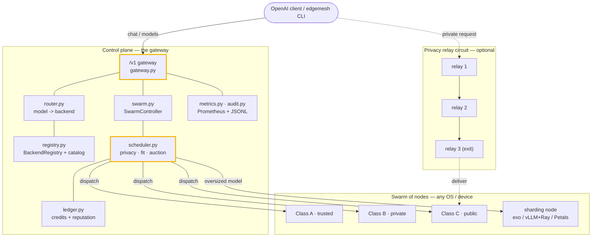
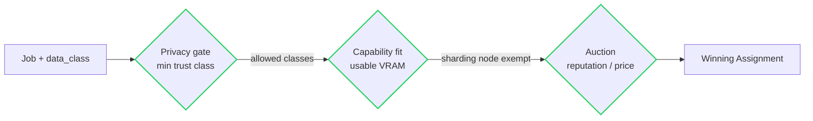
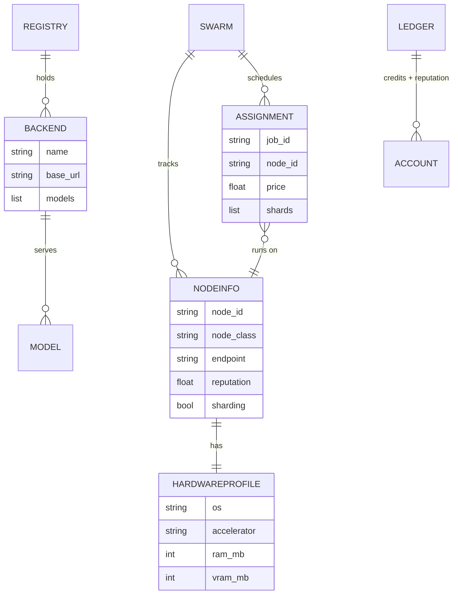

# Architecture

edgemesh has two layers that build on each other. The **gateway** unifies every
OpenAI-compatible backend you run behind one model catalog and one `/v1`
endpoint. The **swarm** grows that into a trust-tiered, scheduled, credit-metered,
optionally onion-routed compute network. The core is pure standard library
(Python 3.10+); two features are opt-in extras (mTLS dev certs, the privacy
relay's `cryptography`).

## The whole picture

## Components

### Backends & discovery (`edgemesh/backends.py`)
A *backend* is any OpenAI-compatible endpoint — the Cognis fleet, Ollama,
llama.cpp, vLLM/TGI, a hosted API. `probe()` reads `{base_url}/v1/models` to learn
what it serves; `discover()` sweeps a set of known local ports (8772–8774 fleet,
11434 Ollama, 8080 llama.cpp, 8000 vLLM, …) and registers whatever answers.

### Registry & catalog (`edgemesh/registry.py`, `edgemesh/catalog.py`)
`BackendRegistry` holds backends by name and computes the **aggregated model
catalog** — a map of `model -> [backends that serve it]`. A model served by more
than one backend is automatically a failover set. `catalog.py` is a separate
curated list of open-weight models with rough VRAM footprints, used to *fit a
model to the hardware* a node actually has.

### Router (`edgemesh/router.py`)
Resolves a requested model to a `(backend, upstream_model)` pair. Explicit
`backend::model` pins win; otherwise the first backend (by name) that lists the
model is chosen, with `candidates()` giving the full failover order.

### Swarm control plane (`edgemesh/swarm.py`, `edgemesh/protocol.py`)
`SwarmController` is the in-memory orchestration core: a **node registry** (each
`NodeInfo` carries trust class, `HardwareProfile`, reputation), `register` /
`heartbeat` / `prune` for membership, and `submit` / `complete` for jobs.
`protocol.py` is the JSON-serializable wire contract plus HMAC short-lived bearer
tokens.

### Scheduler (`edgemesh/scheduler.py`)
Three gates, in order:

1. **Privacy** — `confidential -> Class A only`, `private -> A/B`, `public -> any`.
2. **Fit** — the node needs enough `usable_vram_mb()`; sharding nodes (exo /
   vLLM+Ray / Petals / llama.cpp RPC) span machines and are exempt.
3. **Auction** — among the eligible, `reputation / price` wins (single-fit nodes
   slightly preferred over sharding for models that fit on one box).

### Ledger (`edgemesh/ledger.py`)
Compute **credits** (consumers spend, nodes earn) and **reputation** (success
`×1.05`, failure `×0.80`, clamped). This is an internal accounting unit — **not**
a cryptocurrency, token, or tradeable security, deliberately.

### Privacy relay (`edgemesh/relay.py`)
Onion-style multi-hop relaying: the client wraps a request in one X25519 +
AES-GCM layer per hop, each padded to a fixed bucket. Each relay peels exactly one
layer and learns only the next hop; the exit delivers to the compute node. It
**fails closed** without the optional `cryptography` package — never a fake
fallback — and is honest that it is not Tor-grade anonymity.

### Gateway, metrics & audit (`edgemesh/gateway.py`, `metrics.py`, `audit.py`)
A stdlib `http.server` that serves `GET /v1/models` (aggregated catalog),
`POST /v1/chat/completions` (routed + relayed verbatim, with streaming), the
`/swarm/*` and `/cluster/*` endpoints, `GET /metrics` (Prometheus text format),
and an append-only **metadata-only** audit log (prompt/response content is never
recorded).

## Data model

## Why these choices

- **Standard library core.** Runs anywhere Python 3.10+ runs — no daemon to
  operate, nothing leaving your machine. The two heavier features (mTLS, relay
  crypto) are opt-in extras.
- **One catalog, many backends.** A model on two backends is a failover set for
  free; the router and gateway just pick.
- **Privacy is a gate, not a bolt-on.** Data sensitivity decides which nodes may
  even be considered, before fit or price.
- **Honest about limits.** The relay says plainly it is not Tor-grade anonymity;
  credits say plainly they are not a token.
